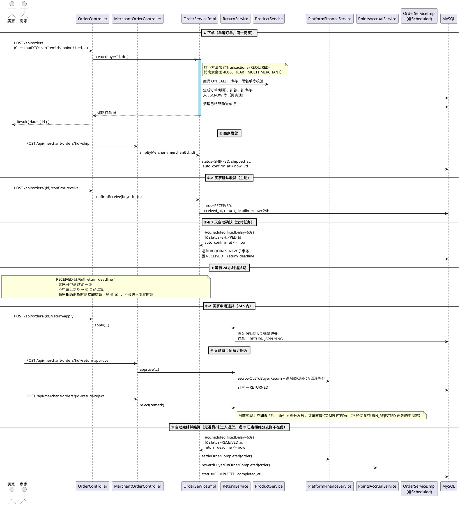

# 核心业务时序图

> 对应实验报告 **4.6 业务流程图与时序图** 章节。  
> 本文与 **`OrderServiceImpl` / `ReturnServiceImpl` / `PlatformFinanceService`** 当前实现一致；HTTP 路径均含全局前缀 `/api`（`server.servlet.context-path`）。

## 一、完整交易时序图（PlantUML 文法，可直接粘贴到在线渲染工具）

**说明**：

- 实际类名/方法以代码为准；财务出入账在 **`PlatformFinanceService`** 中，不在独立的 `WalletService` 类名里。  
- **同一笔订单、同一商家**：与 `CheckoutDTO` + `ensureSingleMerchant` 逻辑一致。  
- **自动确认/自动完结**：`OrderServiceImpl` 使用 **`fixedDelay = 60_000` 毫秒**（约每分钟），**不是** 10 分钟。  
- **拒绝退货**：`ReturnServiceImpl#reject` 在**同一次请求内**完成结算，不会留在「待定时器」状态。  
- **自动完结**扫描条件代码中为 **`status == RECEIVED`** 且 `return_deadline` 已过期，不包含「RETURN_REJECTED 再等定时器」这种分支（`RETURN_REJECTED` 枚举可保留作扩展，与当前主路径无关）。

## 二、关键业务规则补充

### 2.1 中间账户资金托管逻辑

| 阶段 | ESCROW（托管） | 买家余额 | 商家余额 | 平台手续费 |
|------|----------------|----------|----------|------------|
| 下单后 PAID | +actualAmount | 扣减实付 | 0 | 0 |
| 同意退货后 | 按实现退款出账 | 退款到账 | 0 | 0 |
| 正常完结（自动或拒绝退货时立即） | 出账 | — | 增加 merchant 侧实收 | 平台收取手续费 |

**不变式**（设计目标；可对账用）：`Σ` 在 ESCROW 中未结算的货款 = `Σ` 应托管订单。

### 2.2 积分与实付

具体舍入、抵扣比例见 `application.yml` 中 `campus.points` 与 `OrderServiceImpl` 计算逻辑；**100 积分抵 1 元** 与 `README` 一致。

### 2.3 定时任务（与 `OrderServiceImpl` / `CaptchaUtil` 等一致）

| 位置/方法 | 频率（代码） | 作用 |
|------------|--------------|------|
| `OrderServiceImpl#autoConfirmReceiveJob` | `fixedDelay=60_000` ms，初始 `30_000` ms | SHIPPED 且 `auto_confirm_at` 到期 → RECEIVED |
| `OrderServiceImpl#autoCompleteJob` | `fixedDelay=60_000` ms，初始 `45_000` ms | RECEIVED 且 `return_deadline` 到期 → 结算并 COMPLETED |
| `MerchantLevelAdjustServiceImpl` | `cron` 每天 2 点 | 商家等级/费率相关批处理（见该实现） |
| `CaptchaUtil` 中 `@Scheduled` | 约每 5 分钟 | 清理过期验证码 |

（工程内**未**见独立的「解封 `autoUnban`」`@Scheduled` 任务；如后续业务需要再补。）

### 2.4 状态与操作（以 Service 校验为准）

| 操作 | 典型前置 | 置后状态 / 结果 |
|------|----------|-----------------|
| 发货 | PAID | SHIPPED |
| 确认收货（人工/7 天自动） | SHIPPED | RECEIVED，并设 `return_deadline` |
| 申请退货 | RECEIVED 且在退货期内 | RETURN_APPLYING |
| 同意退货 | RETURN_APPLYING | RETURNED + 退款等 |
| 拒绝退货 | RETURN_APPLYING | **直接 COMPLETED** + 本单结算 / 发积分（当前实现） |
| 无退货、收货超 24h | RECEIVED 且超时 | 定时器 → **COMPLETED** + 结算 |

与 `ResultCode.ORDER_STATUS_ILLEGAL(40001)` 等搭配使用。

## 三、并发安全（答辩重点）

典型写法仍在 **`OrderServiceImpl` / `OrderMapper` / `ReturnServiceImpl` 的乐观更新 SQL** 中（`WHERE stock >= qty`、`balance >= amount` 等），且落在 **`@Transactional` 与（必要时）`REQUIRES_NEW` 子事务** 边界内，与实验报告 4.5 代码截图一致。
